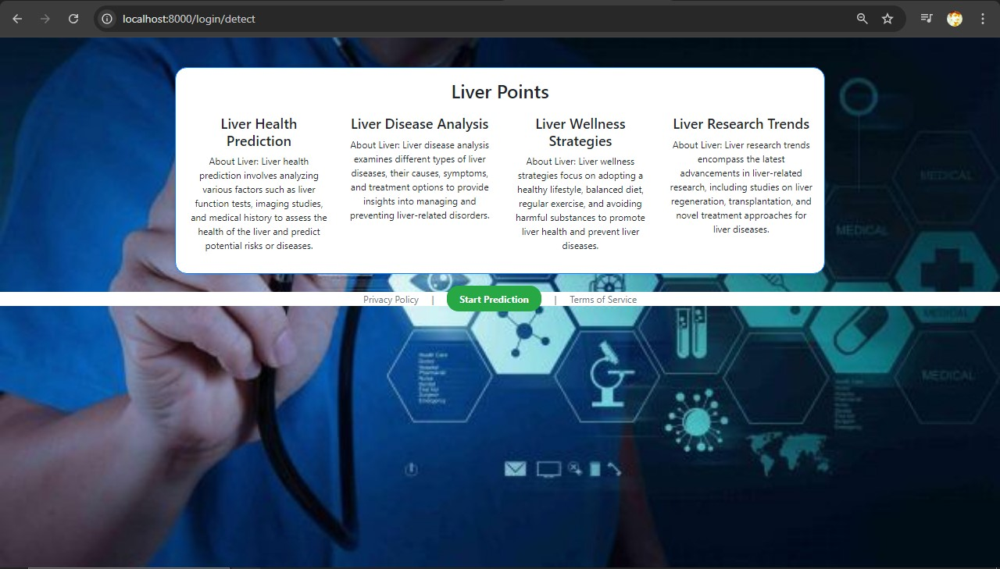
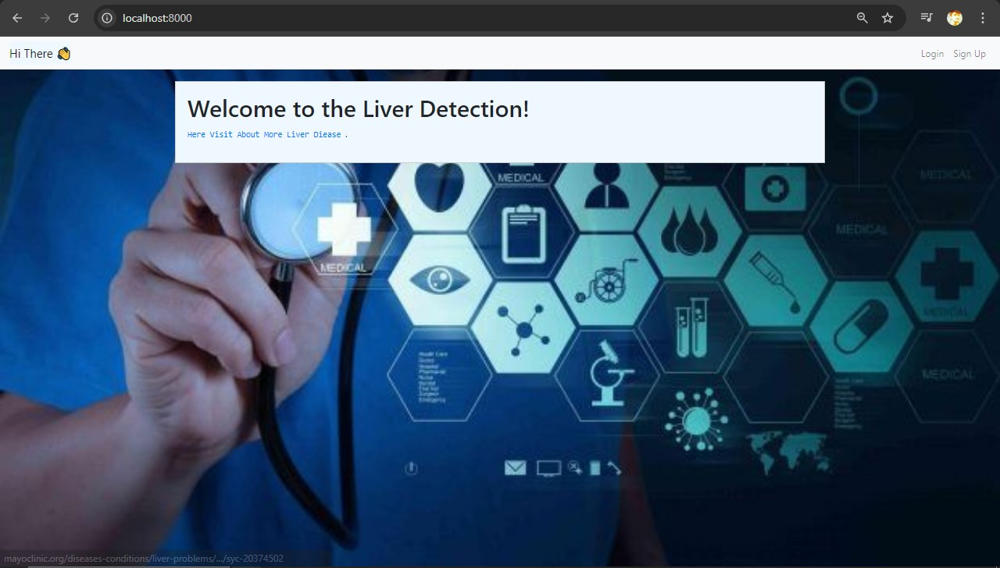
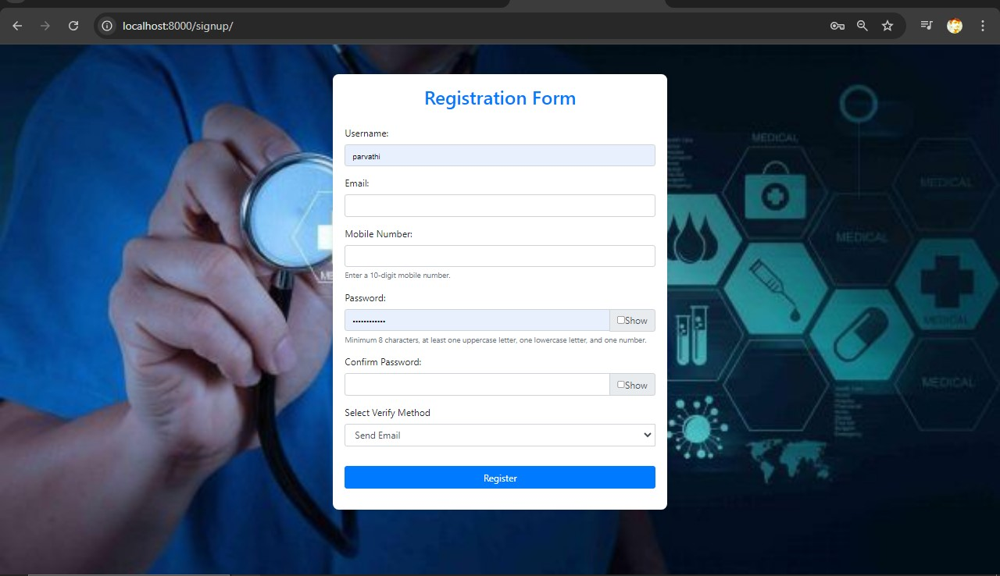
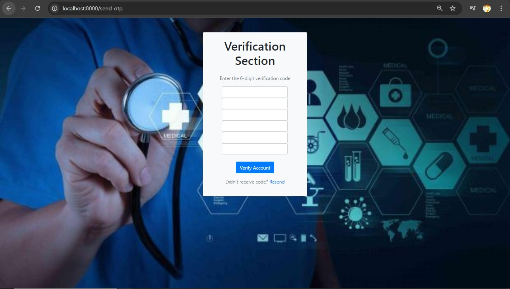
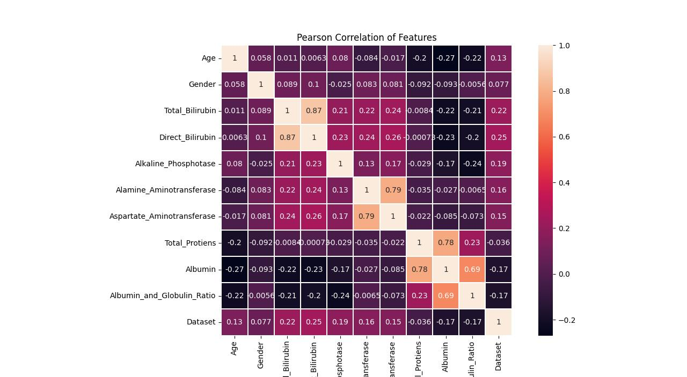
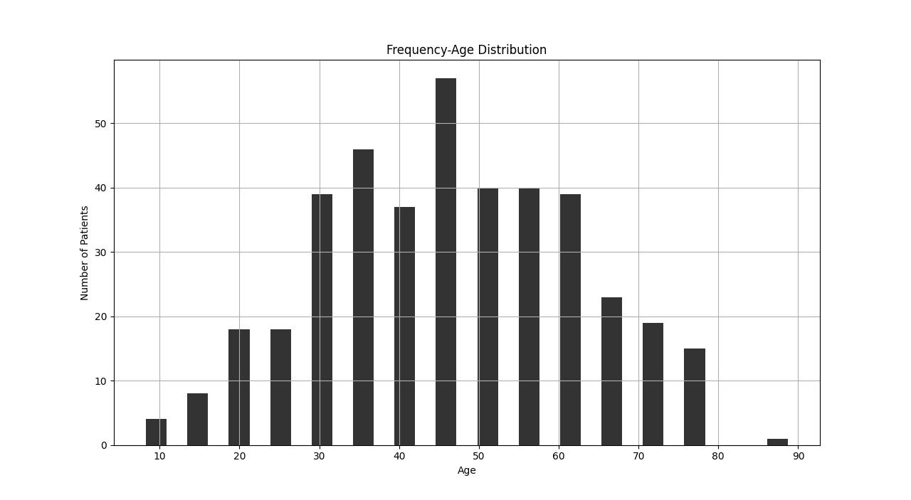
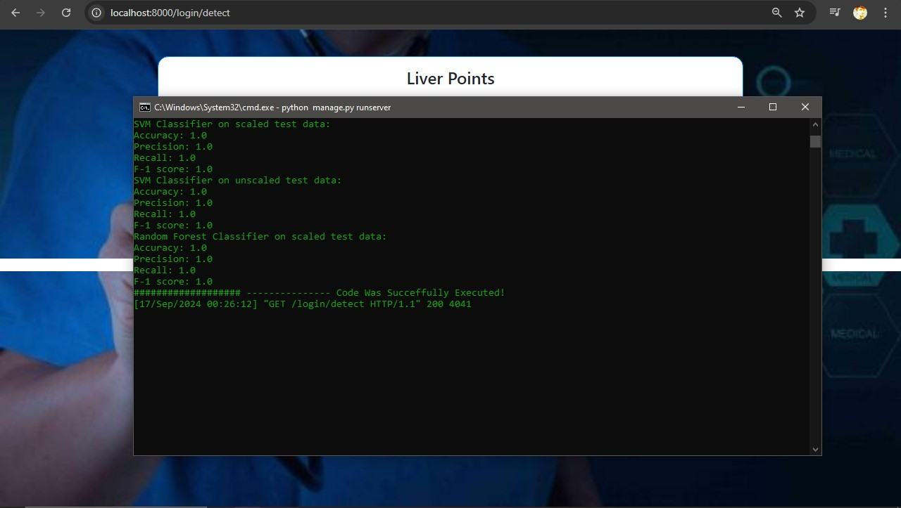

Here's a creative and well-structured `README.txt` for your Django website project. Feel free to customize any part of it to better fit your style or project details:

---

# Liver Disease Analysis Web Application

Welcome to the Liver Disease Analysis project! This Django-based web application is designed to analyze liver disease data using various models and datasets. It provides insights into liver disease features, age distribution, and model performance metrics.

## Features

- **Feature Analysis**: Visualize Pearson correlation coefficients of features related to liver disease.
- **Age Distribution**: Examine the age distribution of individuals affected by liver diseases.
- **Model Performance**: Evaluate the performance of different models with metrics such as F1 score and accuracy.

## Screenshots

Here are some screenshots of the application:

- **Dashboard**: 
- **Index Page**: 
- **Signup Page**: 
- **Verification Page**: 
- **Pearson Analysis**: 
- **Age Distribution**: 
- **Final Score**: 

## Installation

To get started with the Liver Disease Analysis web application, follow these steps:

1. **Clone the Repository**:
   ```bash
   git clone https://github.com/Ram-Devopss/Django-LiverDiease-Analysis-Mode.git
   ```

2. **Navigate to the Project Directory**:
   ```bash
   cd liver-disease-analysis
   ```

3. **Set Up a Virtual Environment**:
   ```bash
   python -m venv venv
   source venv/bin/activate  # On Windows use `venv\Scripts\activate`
   ```

4. **Install Dependencies**:
   ```bash
   pip install -r requirements.txt
   ```

5. **Apply Migrations**:
   ```bash
   python manage.py migrate
   ```

6. **Run the Development Server**:
   ```bash
   python manage.py runserver
   ```

7. **Access the Application**: Open your web browser and go to `http://127.0.0.1:8000/` to view the application.

## Usage

Once the application is running, you can:

- **View Dashboard**: Check the dashboard for an overview of liver disease analysis.
- **Explore Features**: Navigate through the pages to view feature analysis and model performance.
- **Sign Up / Log In**: Create an account or log in to access personalized features and data.

## Contributing

We welcome contributions to this project! If you have suggestions, improvements, or bug fixes, please fork the repository and submit a pull request. 

## Contact

For any issues or questions, feel free to reach out to me at [ramdevops2005@gmail.com](mailto:ramdevops2005@gmail.com).

---

Thank you for using the Liver Disease Analysis web application. We hope you find it useful and insightful!

---

Feel free to adapt this template as needed. If you have any additional details you'd like to include or specific preferences, just let me know!
